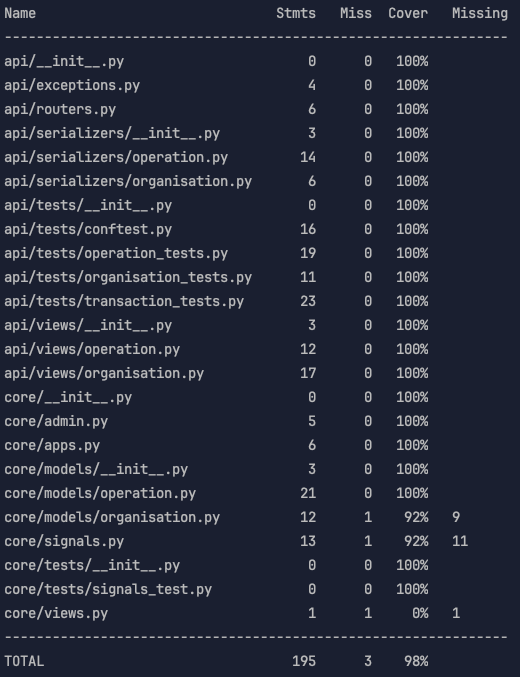

# Payments System — Django Interview

## Описание проекта

Тестовое задание, реализующие обработку
входящих запросов от банка с последующим начислением на баланс организации.

## Задачи проекта

* принимает входящие webhook-и от банка и обрабатывает их
* Начисление баланса организации по инн
* Ведение лога транзакций

## Технологии

* Python
* Django
* Django-Rest-Framework
* Pytest
* MySQL

## Установка и запуск

В проекте используется менеджер пакетов **uv**

### Создание виртуального окружения

```shell
uv venv my-venv
```

### Активация виртуального окружения

```shell
source my-venv/bin/activate
```

### Добавление новой зависимости

```shell
uv add package-name
```

### Выполнение миграций

```shell
python manage.py migrate
```

### Запуск проекта

```shell
python manage.py runserver
```

## Тестирование

Для проведения тестирования использовалась библиотека **pytest**,
для просмотра отчета **coverage**

### Запуск тестирования
```shell
pytest
```
### Дополнительная информация 
На данный момент проект покрыт тестами на **98%**

